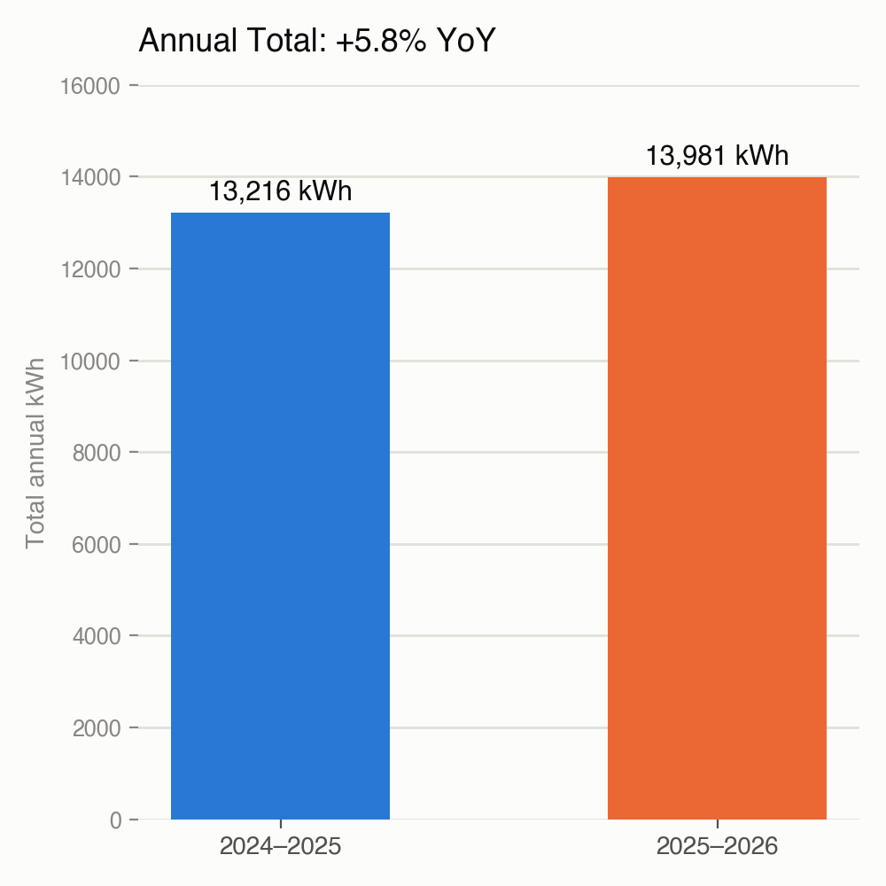
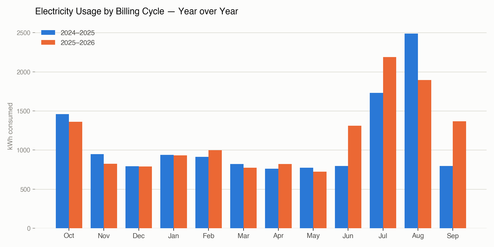

# Electricity Usage — Year-over-Year Analysis

Comparing billing cycles Oct 2024–Sep 2025 ("2024–2025") vs Oct 2025–Sep 2026 ("2025–2026"), aligned by cycle month.

Interactive chart: https://claude.ai/artifact/XZZMB7MgXsj2e2X1KiT9ac
Data: `data/electricity_usage.csv`

## Headline

- **2025–2026 total: 13,981 kWh**
- **2024–2025 total: 13,216 kWh**
- **Change: +765 kWh (+5.8%)** — usage is up year over year.

## Month-by-month

| Month | 2024–25 kWh | 2025–26 kWh | Change | % Change |
|---|---:|---:|---:|---:|
| Oct | 1,458.48 | 1,360.13 | −98.35 | −6.7% |
| Nov | 948.79 | 825.59 | −123.20 | −13.0% |
| Dec | 791.35 | 790.05 | −1.30 | −0.2% |
| Jan | 936.61 | 931.22 | −5.39 | −0.6% |
| Feb | 913.71 | 996.99 | +83.28 | +9.1% |
| Mar | 822.40 | 773.09 | −49.31 | −6.0% |
| Apr | 761.66 | 821.45 | +59.79 | +7.9% |
| May | 772.75 | 722.15 | −50.60 | −6.5% |
| Jun | 795.36 | 1,310.67 | +515.31 | +64.8% |
| Jul | 1,730.21 | 2,188.76 | +458.55 | +26.5% |
| Aug | 2,489.53 | 1,893.94 | −595.59 | −23.9% |
| Sep | 795.27 | 1,366.82 | +571.55 | +71.9% |

## What's driving the increase

- **Fall through spring (Oct–May) is flat to slightly down.** Most months differ by single digits percentage-wise, several down 6–13%. This part of the year is not the source of the increase.
- **The increase is concentrated in summer/early fall.** June (+65%), July (+27%), and September (+72%) together added roughly **+1,545 kWh** versus the prior year.
- **August bucked the trend**, dropping **−596 kWh (−24%)**, partially offsetting the summer increase. Worth checking whether this is a real usage drop or a shifted billing-cycle boundary (read dates moved from 8/13 to 8/13 — same date, so likely a real drop, or reads shifting load into July/September).
- Net of these swings: **+765 kWh (+5.8%)** more electricity used this year.

## Open questions worth checking

- What changed around June–September (added AC use, more occupancy, a new appliance, extra heat) that would explain the summer spike?
- Why did August drop sharply while the months on either side (July, September) both spiked? Could reflect a read-date shift, a vacation/absence, or a real efficiency change that didn't hold.
